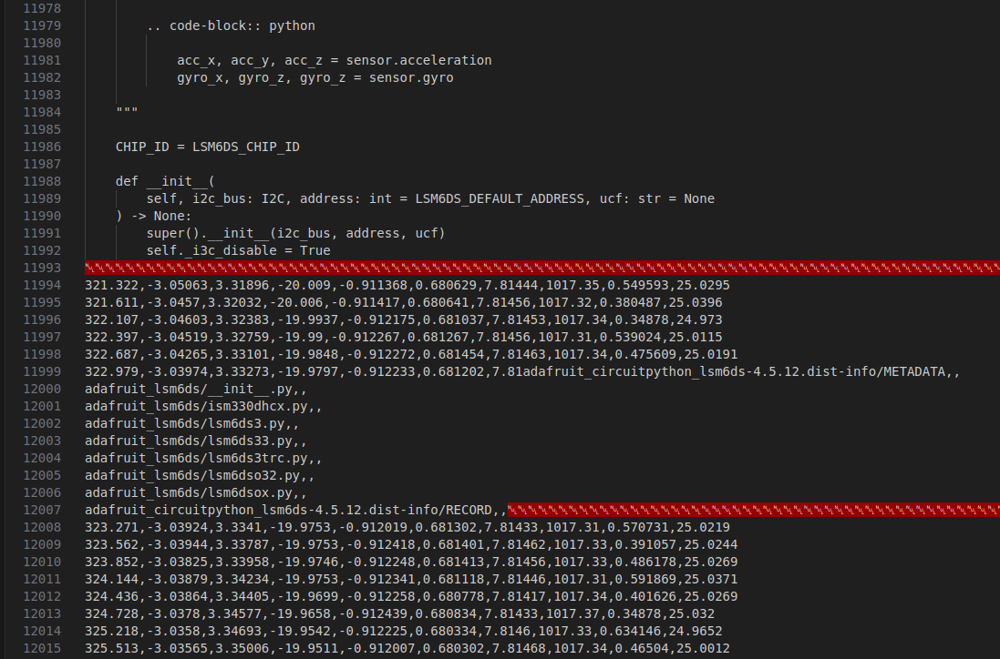

# CESINOVA 2 flight data recovery

During CESINOVA 2 flight, the onboard computer failed and recorded corrupted data, making it impossible to open any file.\
This repository contains all the code used to try to recover the data bits from a image dump.

## Usage

The repository is divided in 2 parts:
- `recover.ipynb`: Go notebook used to generate csv file containing the recovered data from the image
- `graph.py`: Python script used to generate graphs from the recovered csv files

To use it you'll need [Jupyter](https://jupyter.org), [gophernotes](https://github.com/gopherdata/gophernotes), [Python](https://python.org) (with modules [matplotlib](https://pypi.org/project/matplotlib) and [pandas](https://pypi.org/project/pandas))

The input file can be anything as long as it contains packets. In our case it is the dump of the FAT16 filesystem of the onboard Raspberry Pi Pico. This is why in the file you'll see Python files with bits of CSV data.

The data extraction process is explained in the notebook.

The script seems to have recovered every data remaining on the FS, but unfortunatelly none of that data seems to be from a flight, only from when the computer was being tested or when the rocket was idling before and after the launch :(